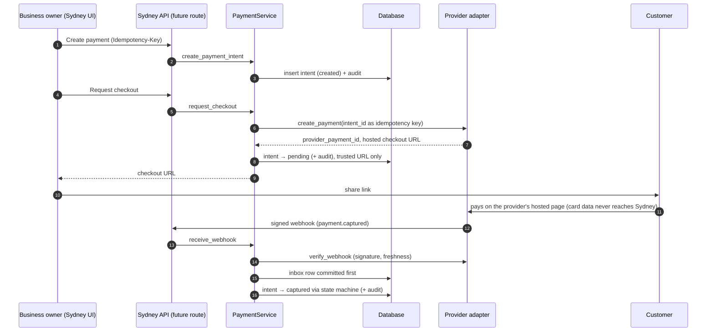

# Payment orchestration foundation (inactive)

> **Status: inactive preparation, not a payment processor.** Nothing in the
> running application uses this module. It is not PCI-certified, has no real
> provider integration, and must not be described as production-ready. It is a
> secure foundation for a future integration.

Code: `backend/app/payments/` · Migration: `backend/alembic/versions/f6a7b8c9d0e1_add_payment_orchestration_foundation.py` ·
Tests: `backend/tests/test_payments_{domain,service,migration}.py`

## What it does

A provider-agnostic way for a business to **initiate and track** a payment
through an external provider's hosted checkout, and to refund it:

- `PaymentIntent` — a request to collect a specific amount, with an explicit state machine.
- `PaymentRefund` — full or partial refunds, never exceeding what was captured.
- A typed provider adapter contract, with only a deterministic `FakePaymentProvider` for tests.
- A durable inbox for **verified** provider webhooks, with retries.
- An append-only audit trail of every status change.
- A transaction-safe service layer, tenant-isolated and role-checked.
- Request/response schemas and a router module for later — **not registered**.

## What it deliberately does not do

- **No card data.** It never accepts, stores, forwards or logs card numbers,
  CVV/CVC, expiry dates, track/magnetic-stripe data, PINs, bank credentials or
  provider secrets. Customers pay on the provider's hosted page.
- **No real provider.** Grow, Cardcom, Arbox, MAX, CAL, PayPlus and others are
  not implemented; that requires official documentation and credentials.
- **No routes.** `app/payments/router.py` is never included in `app.main` or
  `app.api.router`; a test asserts no `/api/payments` route exists.
- **No link to sales.** It does not create `Sale` rows, and does not touch the
  sales flow, the existing Grow/Cardcom connections, or the existing
  `webhook_events` inbox.
- **No live database change.** The migration exists but has not been applied
  to Supabase.

## Payment lifecycle

```
created ──► pending ◄──► requires_action
   │           │               │
   │           ▼               ▼
   ├──────► authorized ──► captured ──► partially_refunded ──► refunded
   │                                            └──────────────────┘
   └──► failed / cancelled / expired      (terminal; any pre-capture state)
```

- Only moves listed in `PAYMENT_TRANSITIONS` (`state_machine.py`) are allowed;
  anything else raises `InvalidTransitionError`. Backward moves (e.g.
  `captured → pending`) are impossible.
- `pending ↔ requires_action` is lateral (e.g. 3-D Secure, then back to processing).
- `failed`, `cancelled`, `expired`, `refunded` are terminal.
- Receiving the status a payment already has is an idempotent no-op.
- Refunds: `pending → succeeded | failed`, both terminal.
- The database has a CHECK constraint on every status column.

## Tables and constraints

| Table | Key constraints |
|---|---|
| `payment_intents` | unique `(business_id, idempotency_key)`; unique `(business_id, provider, provider_payment_id)`; partial unique `(business_id, external_reference)` while the intent is live (not failed/cancelled/expired) — prevents charging the same order twice; `0 < amount_minor ≤ 10¹²`; `0 ≤ refunded ≤ refund_reserved ≤ captured ≤ amount`; upper-case 3-letter currency; `checkout_url` must be `https://`; `version ≥ 1` |
| `payment_refunds` | unique `(business_id, idempotency_key)`; unique `(business_id, provider_refund_id)`; positive bounded amount; status CHECK |
| `payment_webhook_events` | unique `(business_id, provider, provider_event_id)`; status CHECK; `attempt_count ≥ 0` |
| `payment_audit_events` | append-only (ORM guard + DB triggers on SQLite and PostgreSQL); unique `(payment_intent_id, sequence)` |

All four tables are `BusinessOwned` (tenant guards in `app/core/tenant.py`),
have RLS enabled on PostgreSQL like every other tenant table, and use
`ON DELETE RESTRICT` towards payments so financial history cannot be deleted
by cascade.

Money is stored as `BIGINT` minor units (`amount_minor`). Currencies are an
explicit ISO 4217 allowlist with official exponents (`currency.py`); add a
code only after confirming its exponent and the provider's support.

## Provider adapter contract

`providers/base.py` defines `PaymentProviderAdapter` (a typed `Protocol`):

| Method | Purpose |
|---|---|
| `create_payment(ProviderCreatePaymentRequest)` | Start a hosted checkout; returns provider payment id, status, checkout URL |
| `get_payment(provider_payment_id)` | Poll status (reconciliation) |
| `cancel_payment(provider_payment_id)` | Cancel/void before capture |
| `refund_payment(ProviderRefundRequest)` | Full/partial refund |
| `verify_webhook(headers, body, received_at)` | Authenticate and parse a delivery into a `VerifiedProviderEvent` |

Adapters must: use the given `intent_id` / `refund_id` as the provider-side
idempotency key; verify webhooks with constant-time comparison and a freshness
window where the provider signs timestamps; declare `allowed_checkout_hosts`;
raise `ProviderError(retryable=...)` with messages free of secrets and
payloads; set `test_only = False` only for real adapters. Provider payloads and
field names never leave the adapter.

`PaymentProviderRegistry` refuses any `test_only` adapter when
`APP_ENVIRONMENT=production`, and `FakePaymentProvider` itself refuses to be
constructed in production (fail closed twice). `build_default_registry()`
currently returns an empty registry.

## Idempotency

- Every create-intent and create-refund call requires an `idempotency_key`
  (8–128 safe characters), unique per business **per operation** at the
  database level.
- The service stores a SHA-256 fingerprint of the request parameters. The same
  key with the same parameters returns the original object; with different
  parameters it raises `IdempotencyConflictError` (HTTP 409 when routed).
- Concurrent requests with the same key: one insert wins, the other catches the
  unique violation and returns the winner's object.
- Provider calls reuse the intent/refund id as their idempotency key, so a
  retry after any failure cannot create a second provider payment or refund.

## Webhook processing

1. The adapter verifies the delivery. **Unverified deliveries are rejected and
   never stored**; only the provider name and business id are logged.
2. The verified event is written to `payment_webhook_events` and **committed**
   before it is applied. Only a whitelisted, size-bounded summary is stored
   (event type, provider ids, amount, currency, time, sanitized failure
   reason) — never the raw body, headers or signature.
3. A duplicate `(business, provider, provider_event_id)` is a no-op — unless
   the earlier event is still `received` (for example, the worker stopped
   after the durable insert) or its earlier attempt failed, in which case the
   redelivery retries it.
4. Applying an event goes through the state machine under a row lock:
   - valid move → `processed`;
   - repeat of the current status → `processed`, no change;
   - backward/out-of-order move, unknown payment, money mismatch (currency or
     captured amount) or a refund not initiated through Sydney → `ignored`
     with a reason (not retried);
   - unexpected/transient error → `failed`, `attempt_count` and a sanitized
     `last_error` recorded; retry with `retry_webhook_event` (max 10 attempts,
     then manual review).
5. Every applied change writes an audit row linked to the webhook event.

Replay protection: freshness window in the adapter (5 minutes in the fake) +
unique event ids in the inbox.

## Refund rules

- Only `captured` or `partially_refunded` payments can be refunded.
- A refund **reserves** its amount at creation (`refund_reserved_minor`);
  `amount ≤ captured − reserved`, and the database enforces
  `refunded ≤ reserved ≤ captured`.
- Omitting the amount refunds everything still refundable.
- Two-phase: (1) lock the intent, check, reserve and insert the pending refund,
  **commit**; (2) call the provider with the refund id as idempotency key and
  record the outcome. If the provider declines, the refund is `failed` and the
  reservation is released. If the provider call fails transiently, or the
  final commit fails, the refund stays `pending` with its reservation and
  `retry_pending_refund` completes it using the same idempotency key — never a
  second refund.
- Status becomes `partially_refunded` or `refunded` from the sum of succeeded refunds.

Concurrency: the intent is locked with `SELECT … FOR UPDATE` on PostgreSQL and
versioned (`version`, checked on every UPDATE) everywhere. The test suite runs
the concurrent-refund scenario on SQLite (version conflict) and, when
`PAYMENTS_TEST_POSTGRES_URL` is set, on PostgreSQL (row lock); in both, exactly
one of two racing 70% refunds succeeds.

## Tenant isolation and permissions

- Every service method requires a business scope and filters on it; a
  request-scoped session additionally applies the tenant guards, and the
  service refuses an actor whose business differs from the session's.
- Roles (existing Sydney model — there is no business-level "admin" role):

| Role | view | create | cancel | refund |
|---|---|---|---|---|
| business `owner` | ✓ | ✓ | ✓ | ✓ |
| business `manager` | ✓ | ✓ | | |
| business `viewer` | ✓ | | | |
| platform `support` | | | | |
| platform `admin` / `superadmin` (not a member) | counts only (`admin_status_counts`) | | | |

  A platform admin who is also a member of the business gets that business
  role's permissions. No view exposes provider secrets or card data (none are
  stored). When routes are activated, `protect_workspace` already blocks
  support accounts on business routes and viewers on non-GET requests.

## Security notes

- Request schemas use `extra="forbid"`, strict types, length/pattern limits,
  and reject free text that contains a Luhn-valid card number.
- No authorization headers, signatures, secrets, payloads or customer
  free text are logged; logs carry ids, statuses and exception types only.
- Checkout URLs come only from adapters and must be `https` on the adapter's
  declared hosts (no credentials, no custom ports). The backend never fetches
  them, so there is no SSRF path.
- Rate limiting: `router.py` applies a per-user `RateLimiter` to money-moving
  routes (30/minute). It is in-process, like the rest of the app's limiter; a
  multi-instance deployment needs a shared store (see `app/core/rate_limit.py`).
- No secrets or credentials exist in this module; the fake provider requires
  a caller-supplied ≥32-byte secret and has no default.

## Adding the first real provider

1. Obtain the provider's **official** API and webhook documentation and
   sandbox credentials; confirm hosted-checkout (no card data touches Sydney),
   idempotency support, refund semantics, webhook signing and retry behaviour.
2. Implement `providers/<name>.py` satisfying `PaymentProviderAdapter`
   (`test_only = False`), mapping the provider's statuses to the normalized
   event types, and declaring `allowed_checkout_hosts`.
3. Store per-business provider credentials encrypted (as `cardcom_credentials`
   already does with Fernet), never in this module's tables or logs.
4. Register it in `build_default_registry` behind configuration.
5. Design the public webhook route: resolve the business from an unguessable
   per-connection token, exempt it from cookie auth in `protect_workspace`,
   enforce body size limits and the adapter's verification.
6. Add adapter contract tests against recorded sandbox responses.

## Before any real payment can be processed

- A real adapter (above) reviewed against official documentation.
- Apply the migration to Supabase (explicit, separate decision).
- Register the router and the webhook route; security review of both.
- Reconciliation job (`get_payment`) for payments whose webhooks never arrive,
  plus schedulers for `expire_due_payments` and failed-webhook retries.
- Monitoring and alerting on `failed` webhook events and pending refunds.
- Shared rate-limit store if running more than one instance.
- Legal/accounting review: terms, refund policy, tax documents, record
  retention (the audit trail is append-only and cascades are restricted —
  business deletion would need a retention decision).
- Provider agreements and PCI DSS scoping (see below).

## PCI and legal limitations

Using a provider's hosted checkout keeps card data out of Sydney's systems,
which typically places a merchant in the smallest PCI DSS scope — but scope is
determined by the provider and an assessor, not by this code. Sydney is **not**
PCI-certified, this module has not been audited, and nothing here constitutes
legal, tax or compliance advice. Consumer-protection, invoicing and data
retention obligations apply once real money moves.

## Future: creating a Sale after capture (not implemented)

When a payment reaches `captured` through a **verified** provider event, a
later step could create the corresponding `Sale` exactly once:

- trigger only from the `pending/authorized → captured` transition applied by
  `_apply_event` (never from API input or an unverified source);
- use `(business_id, provider, provider_payment_id)` as the Sale's external
  idempotency key, mirroring `sale_service.ingest_payment_event`;
- convert `captured_minor` with `currency.to_major_units` for the Sale's
  decimal amounts, and let the existing VAT logic compute tax;
- record the link (payment intent id ↔ sale id) and reflect refunds as Sale
  refunds through the existing refund path.

This connection is intentionally not built now.

## Future hosted-checkout flow


